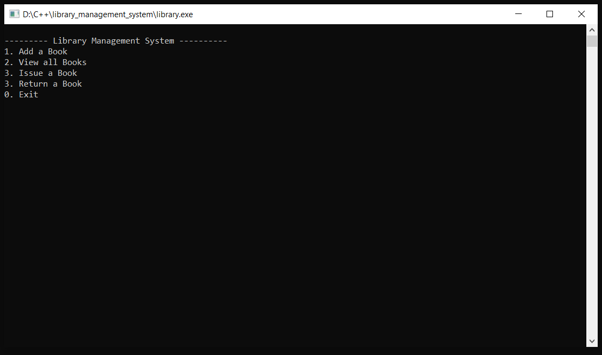
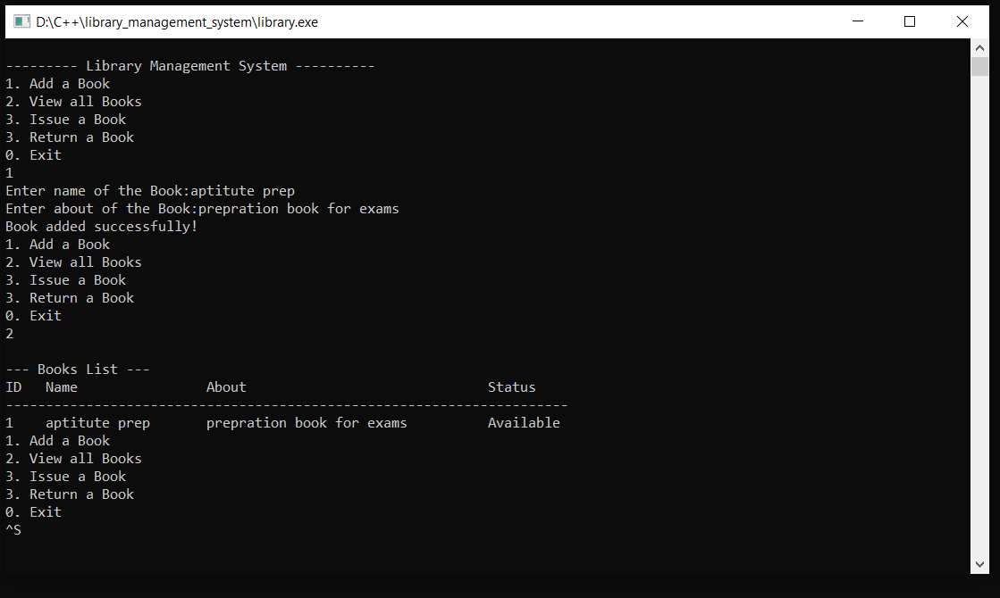

# 📚 Library Book Management System

A simple command-line based C++ project to manage books in a library. It allows you to add books, view the list, issue, and return books. Built to practice object-oriented programming and file/module separation in C++.

---

## 🚀 Features

- Add a new book with title and description
- View all books in a formatted table
- Issue a book by ID
- Return a book by ID
- Organized using classes (`Book`, `LibraryManager`)

---

## 🛠️ Tech Stack

- Language: C++17
- Build: g++ (MinGW on Windows)
- Interface: Command Line Interface (CLI)

---
## Demo 

